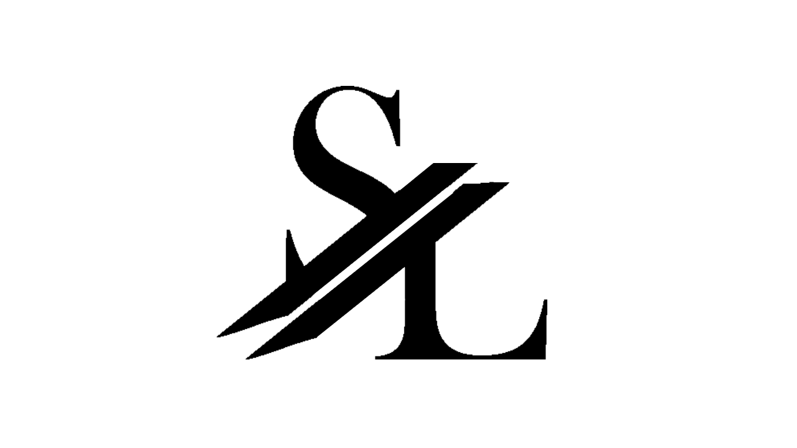

<h1 align="center">Merhaba 👋 Ben "SERCAN LÜLLECİ"</h1>
<h3 align="center">Ben front end developer olarak kendini geliştirmeye çabalayan bir matematikçiyim.</h3>

<h1 align="center"></img></h1>

  Karabük Üniversitesi Matematik Bölümü mezunuyum.Ve bir matematikçi olarak "Front end developer" alanında kariyer yapabilmek için çabalamaktayım.Bu çabalarım online eğitimler yardımıyla  python-sql-c-html , css , javascript , React.js , bootstrap öğrenerek devam etmektedir.

<h3 align="left">Languages and Tools:</h3>

        

<!--
**srcnllc/srcnllc** is a ✨ _special_ ✨ repository because its `README.md` (this file) appears on your GitHub profile.

Here are some ideas to get you started:

- 🔭 I’m currently working on ...
- 🌱 I’m currently learning ...
- 👯 I’m looking to collaborate on ...
- 🤔 I’m looking for help with ...
- 💬 Ask me about ...
- 📫 How to reach me: ...
- 😄 Pronouns: ...
- ⚡ Fun fact: ...
-->

